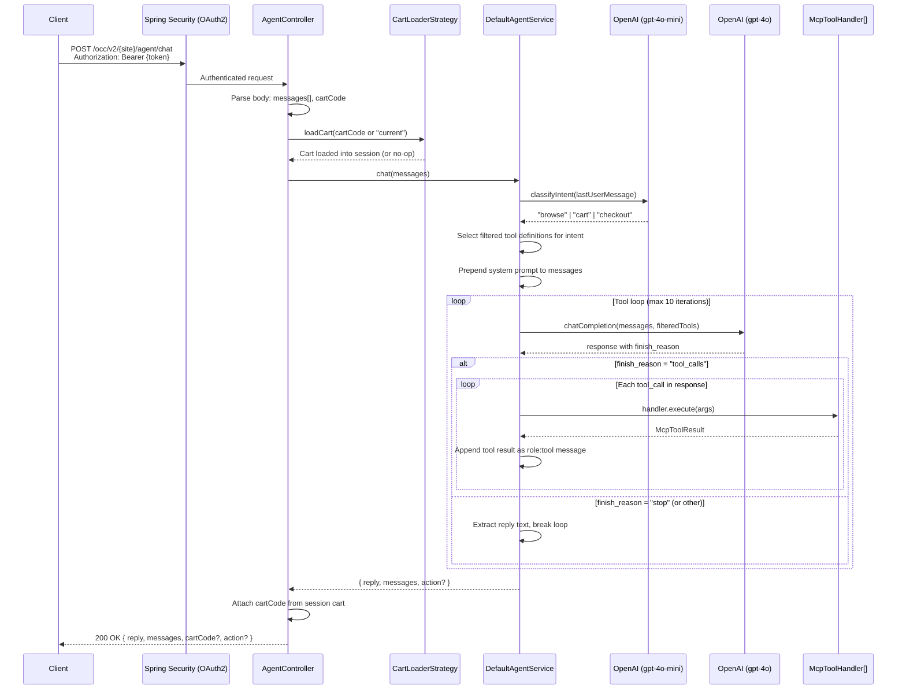
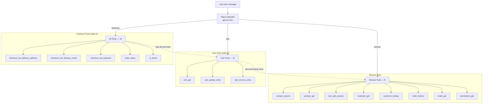
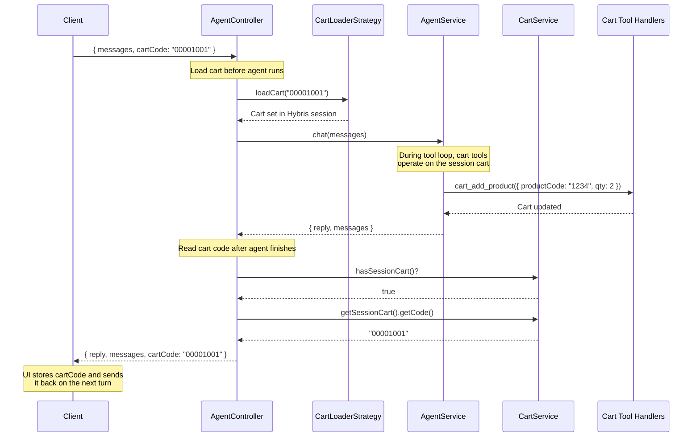

# Agent Chat — Diagrams

## Full Request Flow

End-to-end trace from the client sending a chat message to receiving the agent's response.



## Intent Classification and Tool Filtering

The intent classifier determines which tools are visible to the main model. This reduces token usage and prevents out-of-context tool calls.



## Tool Execution Loop

Detail of the iterative tool-calling loop inside `DefaultAgentService.chat()`.

```mermaid
flowchart TD
    Start([chat called]) --> Classify[Classify intent via gpt-4o-mini]
    Classify --> Select[Select tool definitions for intent]
    Select --> Prepend[Prepend system prompt to messages]
    Prepend --> Call[Call OpenAI chatCompletion<br/>with messages + tools]

    Call --> Check{finish_reason =<br/>"tool_calls"?}

    Check -->|No| Extract[Extract reply from<br/>assistant message content]
    Extract --> Return([Return reply + messages + action])

    Check -->|Yes| Iterate{iteration < 10?}

    Iterate -->|No| Fallback([Return apology message])

    Iterate -->|Yes| ExecTools[For each tool_call:]
    ExecTools --> Lookup[Look up handler by name]
    Lookup --> Execute[handler.execute args]
    Execute --> UICheck{tool = ui_action?}
    UICheck -->|Yes| Capture[Capture action value]
    UICheck -->|No| Skip[ ]
    Capture --> Append[Append role:tool message<br/>with result content]
    Skip --> Append
    Append --> Call
```

## Cart Sync Flow

The controller manages cart state around the agent call so tool handlers that modify the cart (add, update, remove) operate on the correct cart.


