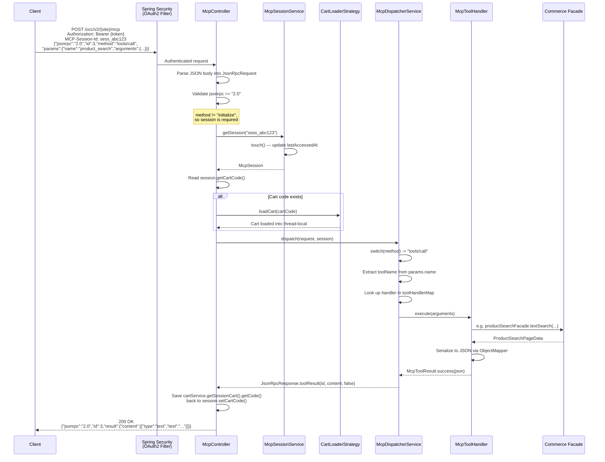
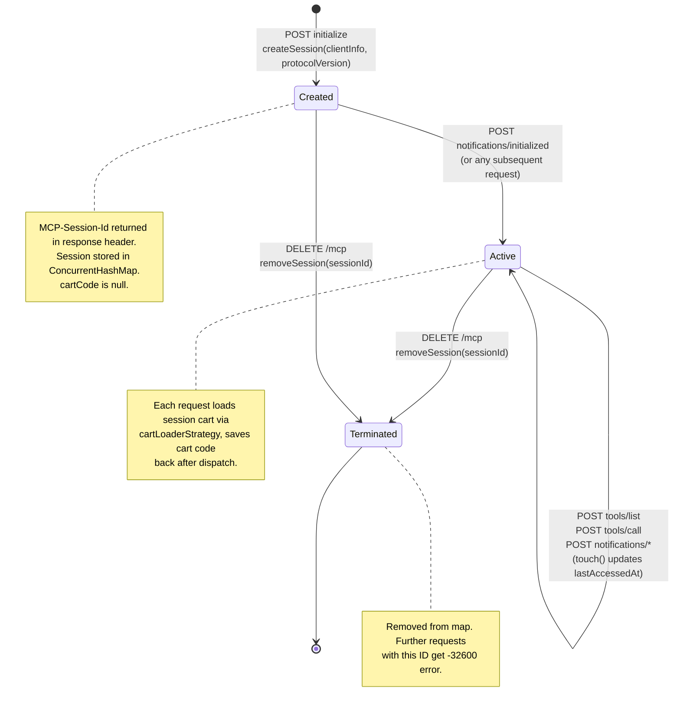
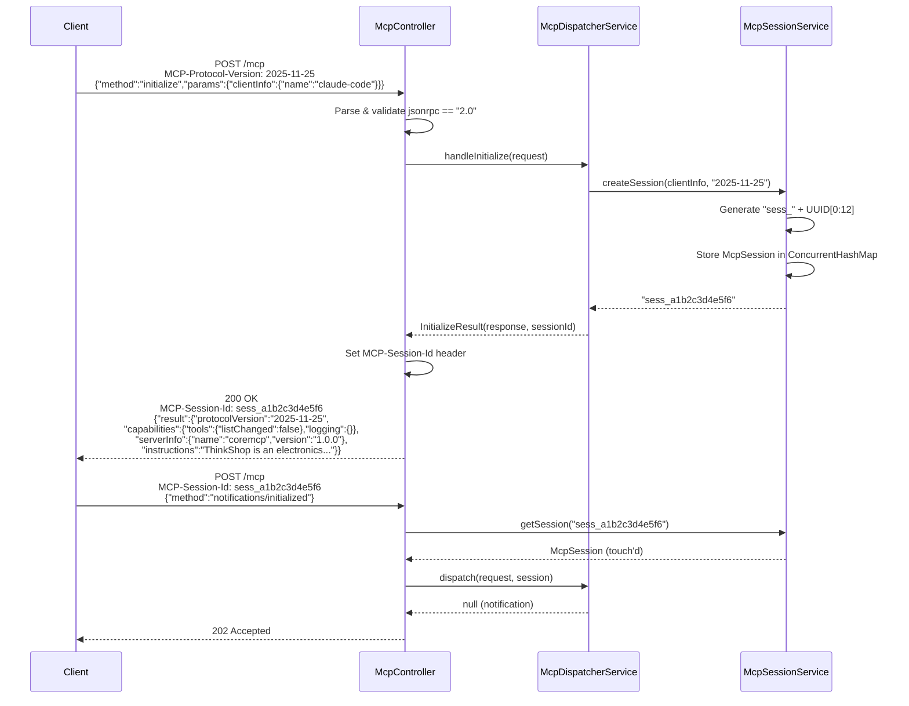

# MCP Protocol — Diagrams

## Full Request Lifecycle

Traces a `tools/call` request from client through OAuth, controller, session validation, cart loading, dispatcher, tool handler, facade, and back.



## Session State Machine

Shows the three states an MCP session passes through and the transitions between them.



## Tool Registry Lookup

How `tools/call` resolves a tool name to a handler and executes it.

```mermaid
flowchart TD
    A["tools/call request<br/>params.name = 'product_search'"] --> B{params present?}
    B -->|No| E1["Error -32602<br/>Missing params"]
    B -->|Yes| C{name present?}
    C -->|No| E2["Error -32602<br/>Missing tool name"]
    C -->|Yes| D{toolHandlerMap.get(name)}
    D -->|null| E3["Error -32602<br/>Unknown tool: {name}"]
    D -->|handler found| F["handler.execute(arguments)"]
    F --> G{Exception?}
    G -->|Yes| H["JsonRpcResponse.toolResult(id,<br/>'Internal error: ...', isError=true)"]
    G -->|No| I["McpToolResult"]
    I --> J{result.isError()?}
    J -->|Yes| K["JsonRpcResponse.toolResult(id,<br/>content, isError=true)"]
    J -->|No| L["JsonRpcResponse.toolResult(id,<br/>content, isError=false)"]
```

## Spring Bean Dependency Graph

Shows how `coremcp-spring.xml` wires the MCP services and tool handlers, and how the controller discovers them.

```mermaid
graph TB
    subgraph "Web Layer (coremcp-web-spring.xml)"
        MC["McpController<br/><i>@Controller, component-scanned</i>"]
    end

    subgraph "Service Layer (coremcp-spring.xml)"
        MDS["mcpDispatcherService<br/><i>DefaultMcpDispatcherService</i>"]
        MSS["mcpSessionService<br/><i>DefaultMcpSessionService</i>"]
        MCSS["mcpCartSessionService<br/><i>DefaultMcpCartSessionService</i>"]
    end

    subgraph "Tool Handlers (coremcp-spring.xml)"
        TH1["productSearchToolHandler"]
        TH2["productGetToolHandler"]
        TH3["cartGetToolHandler"]
        TH4["cartAddProductToolHandler"]
        TH5["cartUpdateEntryToolHandler"]
        TH6["cartRemoveEntryToolHandler"]
        TH7["orderGetToolHandler"]
        TH8["orderHistoryToolHandler"]
        TH9["customerGetToolHandler"]
        TH10["customerLookupToolHandler"]
        TH11["checkoutSetDeliveryAddressToolHandler"]
        TH12["checkoutSetDeliveryModeToolHandler"]
        TH13["checkoutSetPaymentToolHandler"]
        TH14["orderPlaceToolHandler"]
        TH15["promotionsGetToolHandler"]
    end

    subgraph "Platform Beans (existing)"
        PSF["productSearchFacade"]
        PF["productFacade"]
        CF["cartFacade"]
        OF["orderFacade"]
        CKF["checkoutFacade"]
        CUF["customerFacade"]
        PQS["promotionQueryService<br/><i>(custom, uses flexibleSearchService)</i>"]
        CLS["cartLoaderStrategy"]
        CS["cartService"]
    end

    MC -->|"@Resource"| MDS
    MC -->|"@Resource"| MSS
    MC -->|"@Resource"| CLS
    MC -->|"@Resource"| CS

    MDS -->|"property"| MSS
    MDS -->|"property: toolHandlers list"| TH1
    MDS -->|"property: toolHandlers list"| TH2
    MDS -->|"property: toolHandlers list"| TH3
    MDS -->|"property: toolHandlers list"| TH4
    MDS -->|"property: toolHandlers list"| TH5
    MDS -->|"property: toolHandlers list"| TH6
    MDS -->|"property: toolHandlers list"| TH7
    MDS -->|"property: toolHandlers list"| TH8
    MDS -->|"property: toolHandlers list"| TH9
    MDS -->|"property: toolHandlers list"| TH10
    MDS -->|"property: toolHandlers list"| TH11
    MDS -->|"property: toolHandlers list"| TH12
    MDS -->|"property: toolHandlers list"| TH13
    MDS -->|"property: toolHandlers list"| TH14
    MDS -->|"property: toolHandlers list"| TH15

    TH1 --> PSF
    TH2 --> PF
    TH3 --> CF
    TH4 --> CF
    TH5 --> CF
    TH6 --> CF
    TH7 --> OF
    TH8 --> OF
    TH9 --> CUF
    TH10 --> CUF
    TH11 --> CKF
    TH12 --> CKF
    TH13 --> CKF
    TH14 --> CKF
    TH15 --> PQS
```



## Initialize Handshake

The full MCP session initialization sequence showing both the protocol handshake and the internal session creation.


