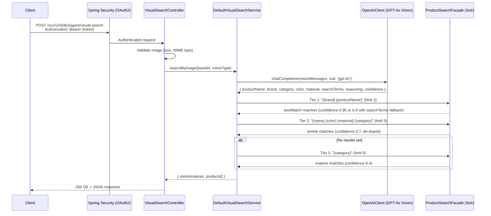
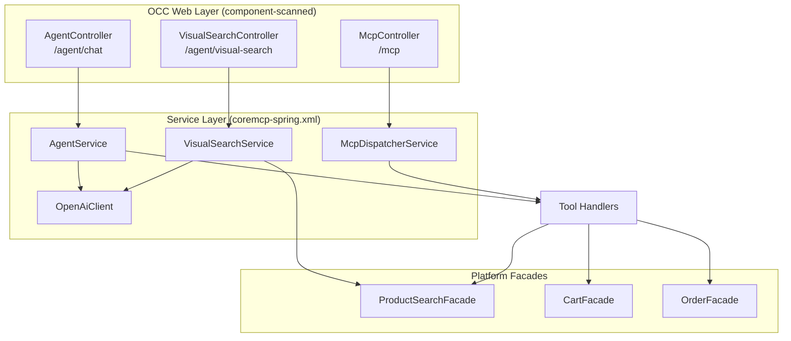

# Visual Product Search — Diagrams

## Request Flow

The visual search request follows the standard OCC pattern through Spring Security, then into custom code.

## Component Architecture

Where visual search fits within the existing coremcp extension.

