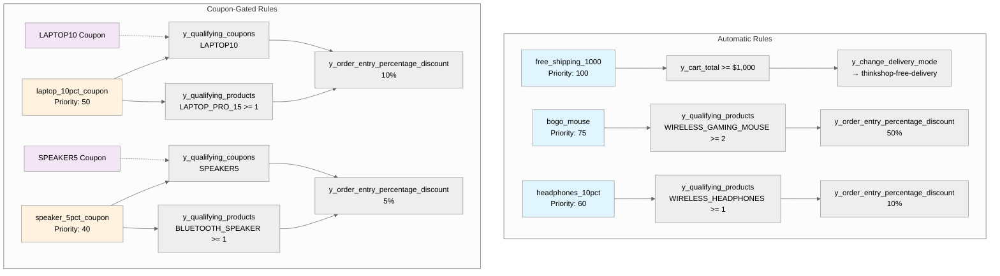

# Promotions Setup — Diagrams

## Rule Structure

Each promotion rule has conditions (when to fire) and actions (what to do). Coupons add a gating condition that requires the customer to enter a code.

## Publish Flow

The script creates rules in the database, then compiles and deploys them to the Drools engine so they are evaluated during cart calculation.

```mermaid
%%{ init: { 'theme': 'neutral' } }%%
graph LR
    subgraph "Groovy Script"
        S1["Create/Update Rules"] --> S2["Create/Update Coupons"]
        S2 --> S3["modelService.save()"]
    end

    subgraph "Publish"
        S3 --> P1["Query DroolsKIEModule<br/>(promotions-module)"]
        P1 --> P2["Query all PromotionSourceRules"]
        P2 --> P3["ruleMaintenanceService<br/>.compileAndPublishRules()"]
        P3 --> P4["Drools Engine<br/>(rules active)"]
    end

    subgraph "Runtime"
        P4 --> RT1["Cart Calculation"]
        RT1 --> RT2["Rules Evaluated"]
        RT2 --> RT3["Discounts Applied"]
    end

    style S3 fill:#e8f5e9
    style P4 fill:#e1f5fe
    style RT3 fill:#fff3e0
```

## All Rules Summary

| # | Code | Priority | Trigger | Condition | Effect | Window |
|---|---|---|---|---|---|---|
| 1 | `free_shipping_1000` | 100 | Automatic | Cart total >= $1,000 | Free delivery (mode swap) | 90 days |
| 2 | `laptop_10pct_coupon` | 50 | Coupon LAPTOP10 | Laptop Pro 15 in cart | 10% off line item | 90 days |
| 3 | `bogo_mouse` | 75 | Automatic | 2+ Gaming Mouse in cart | 50% off line item | 90 days |
| 4 | `headphones_10pct` | 60 | Automatic | Wireless Headphones in cart | 10% off line item | 90 days |
| 5 | `speaker_5pct_coupon` | 40 | Coupon SPEAKER5 | Bluetooth Speaker in cart | 5% off line item | 30 days |
