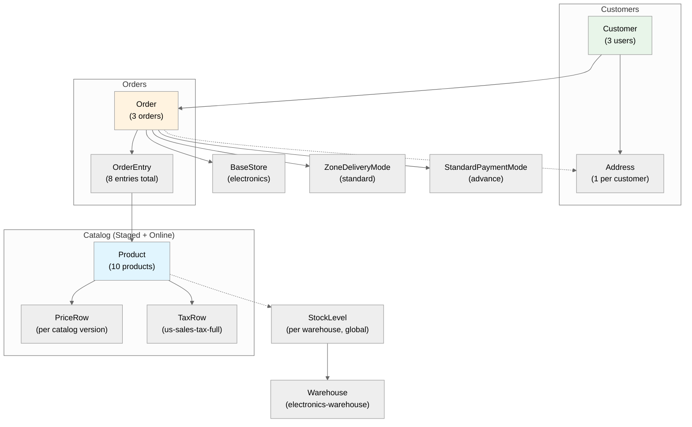
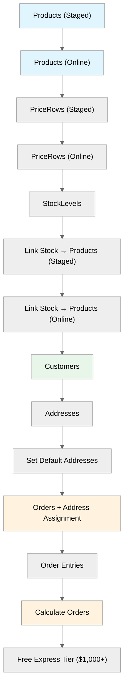

# Sample Data — Diagrams

## Data Model

Shows the relationships between sample data entities. Solid arrows indicate ownership or direct reference. Dashed arrows indicate catalog-versioned links.

## Import Sequence

The ImpEx file processes top-to-bottom. Later blocks depend on earlier ones.

## Order Composition

Detail of what each order contains and its total before calculation.

| Order | Customer | Entry | Product | Qty | Line Total |
|---|---|---|---|---|---|
| THINK-0001 | John Doe | 0 | Laptop Pro 15 | 1 | $1,299.99 |
| THINK-0001 | John Doe | 1 | Wireless Headphones | 2 | $399.98 |
| THINK-0002 | Jane Smith | 0 | Smartphone X | 1 | $799.99 |
| THINK-0002 | Jane Smith | 1 | Tablet Air | 1 | $649.99 |
| THINK-0002 | Jane Smith | 2 | Smart Watch Pro | 1 | $349.99 |
| THINK-0003 | John Doe | 0 | Mechanical Keyboard | 1 | $149.99 |
| THINK-0003 | John Doe | 1 | Wireless Gaming Mouse | 1 | $79.99 |
| THINK-0003 | John Doe | 2 | 4K Monitor 27" | 1 | $499.99 |
