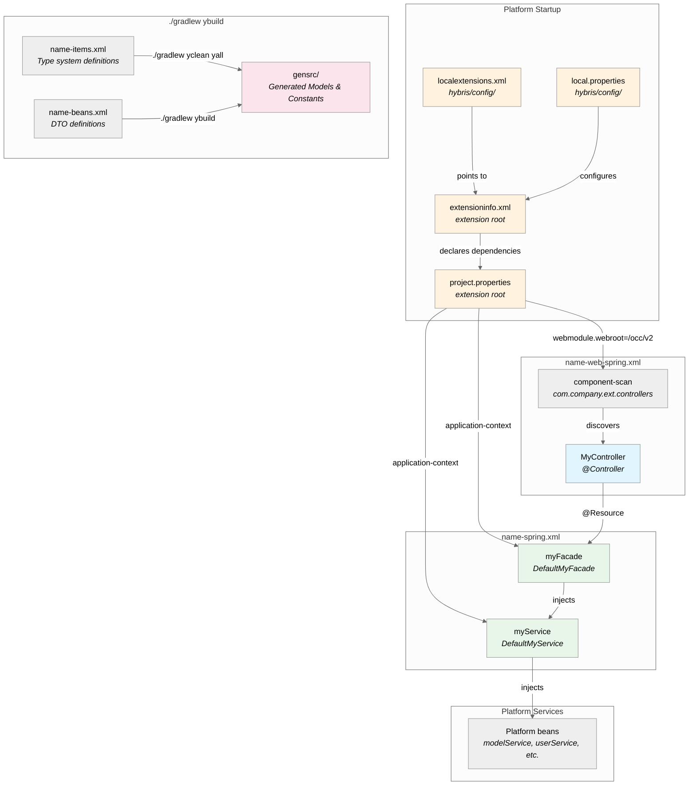

# OCC Extension Setup — Architecture Diagram

How an OCC extension is wired together, from configuration files through code generation to runtime Spring contexts.

## Component Overview

The diagram shows three layers of the extension setup:

- **Platform Startup** — Configuration files that register and configure the extension (`localextensions.xml`, `extensioninfo.xml`, `local.properties`, `project.properties`)
- **Code Generation** — The `./gradlew ybuild` process that generates Java classes from `items.xml` and `beans.xml` definitions
- **Runtime Contexts** — The core Spring context (services, facades) and web Spring context (controllers) that are loaded at startup

## Key Takeaways

- **`project.properties` is the glue** — It tells the platform which Spring XML to load (`application-context`) and where to mount the web module (`webmodule.webroot`). Without it, neither the core beans nor the controllers would be discovered.
- The **web context is a child** of the core context — controllers can inject services/facades, but not the reverse.
- **Component scan** discovers controllers by annotation, so adding a new controller only requires placing it in the extension's controller package.
- **Code generation** from `items.xml` requires `./gradlew yclean yall` (full rebuild), while `beans.xml` changes only need `./gradlew ybuild`.
