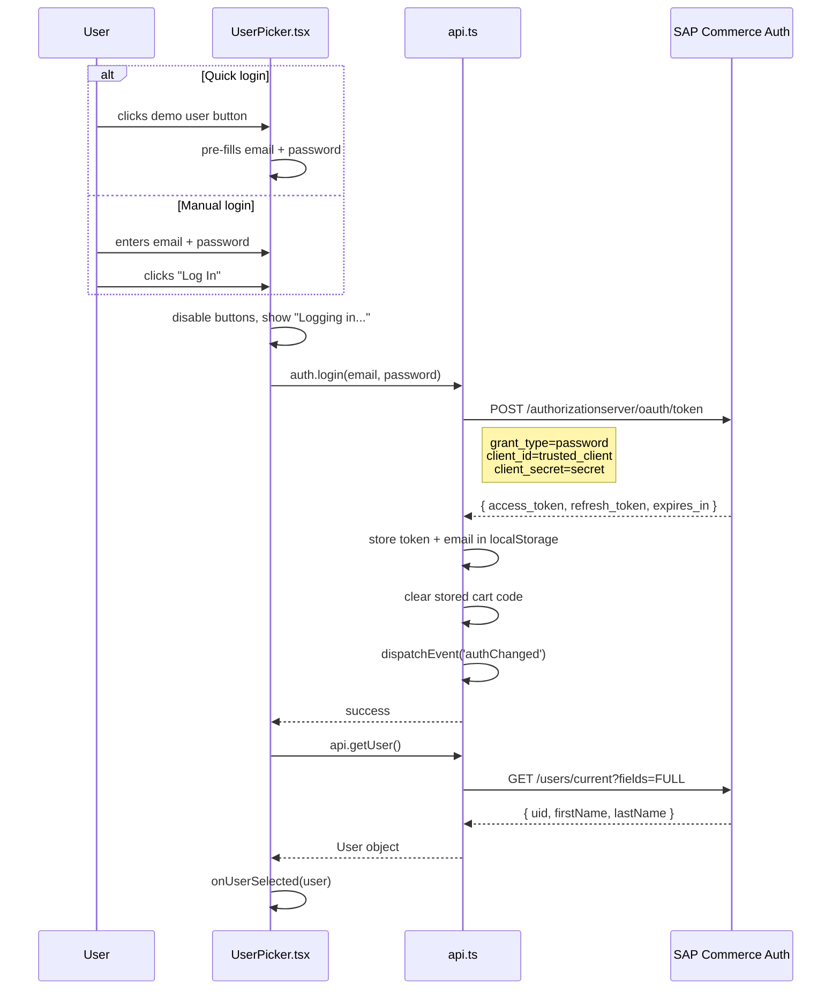
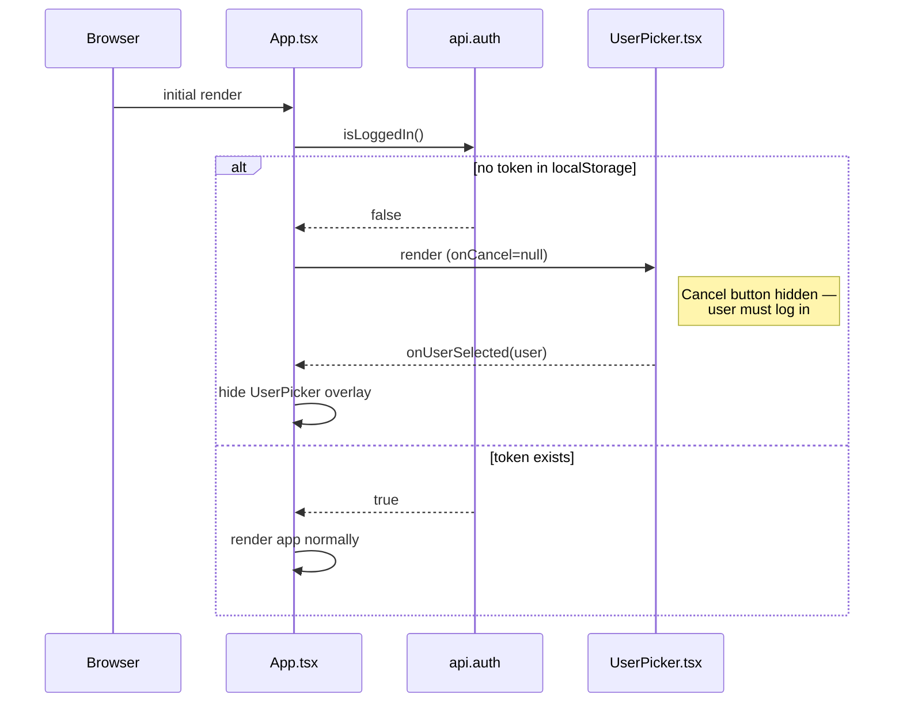
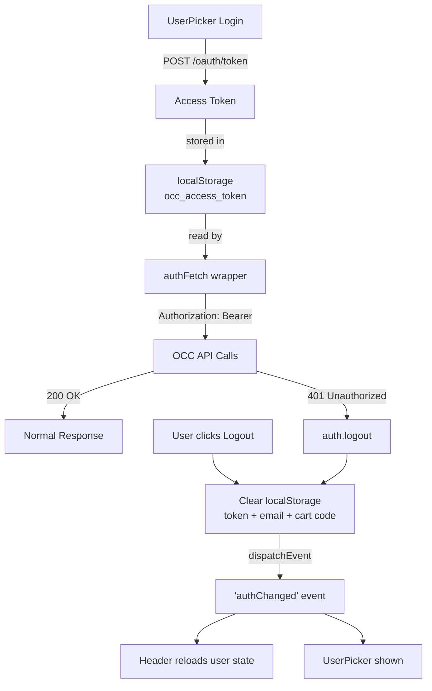
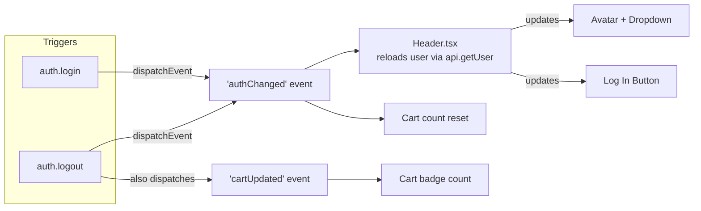

# Authentication — Diagrams

## Login Flow

Shows both the quick-login (demo user button) and manual form paths. Both converge on `auth.login()` which obtains the OAuth2 token.

## Startup Auth Gate

On app load, `App.tsx` checks for an existing token. If none exists, the user must log in before interacting with the app.

## Token Lifecycle

Shows how the token flows from login through API calls to eventual expiry or logout.

## Auth State Propagation

Shows how auth changes propagate across components without React context, using DOM events.

