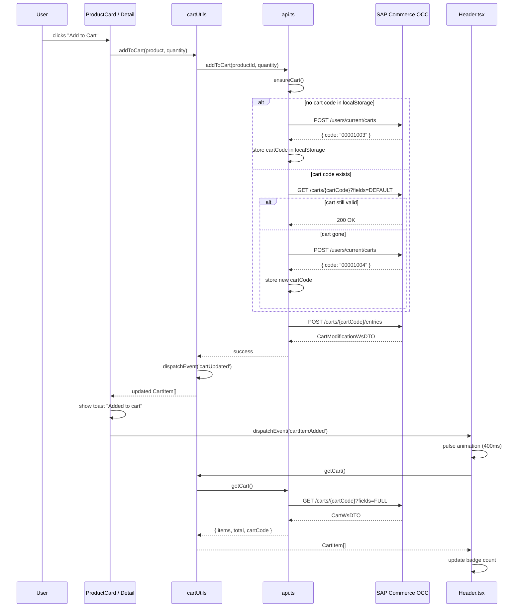
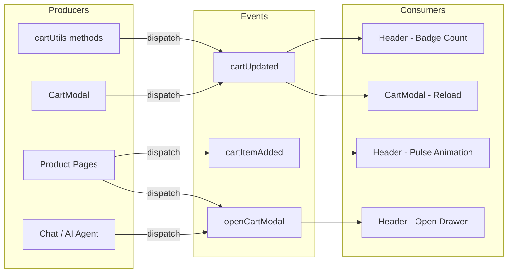
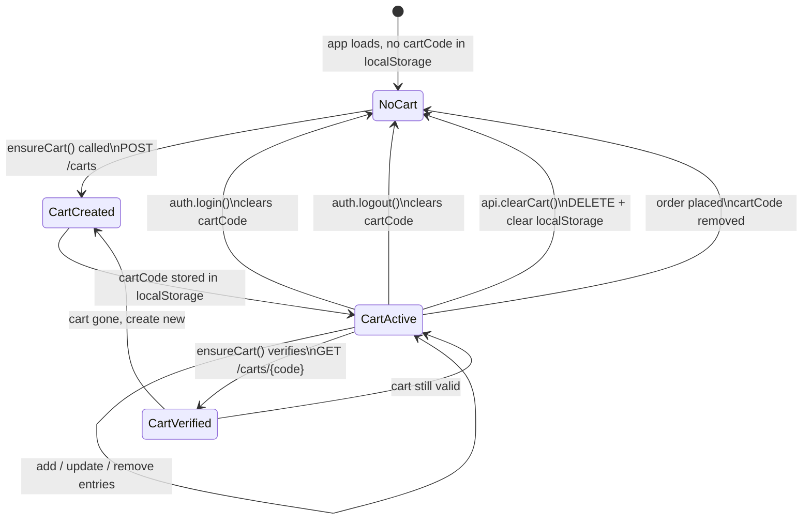

# Cart Management — Diagrams

## Add to Cart Flow

When the user adds a product, `cartUtils.addToCart()` ensures a cart exists via `ensureCart()`, posts the entry to OCC, and dispatches a `cartUpdated` event so the Header badge refreshes. The calling component dispatches `cartItemAdded` separately to trigger the pulse animation.



## Cart State Sync via Window Events

Three custom events keep cart-related components in sync without shared React state. Any component can trigger the cart drawer to open by dispatching `openCartModal`.



## Cart Modal Interaction

The slide-out drawer renders cart entries with quantity controls, promotions, vouchers, and totals. Each mutation reloads the cart from the server and dispatches `cartUpdated` to keep the Header badge in sync.

```mermaid
graph TD
    Header[Header - Cart Icon + Badge]
    Header -->|click / openCartModal event| Modal[CartModal Drawer]
    Modal --> Load[loadCart]
    Load --> Items[Cart Entry List]
    Load --> Promos[Promotions & Vouchers]

    Items --> Qty[Quantity +/- Controls]
    Items --> Remove[Remove Button]
    Modal --> Clear[Clear Cart Button]

    Qty -->|cartUtils.updateCartItem| OCC[OCC API]
    Remove -->|cartUtils.removeFromCart| OCC
    Clear -->|cartUtils.clearCart| OCC

    OCC --> Reload[Reload Cart]
    Reload --> Event[dispatchEvent cartUpdated]
    Event --> Header

    Modal --> Checkout[Proceed to Checkout]
    Checkout -->|navigate| CheckoutPage[/checkout]
    Modal --> Continue[Continue Shopping]
    Continue -->|onClose| Header
```

## Cart Code Lifecycle

The `cartCode` stored in localStorage follows a clear lifecycle tied to authentication and order placement.


