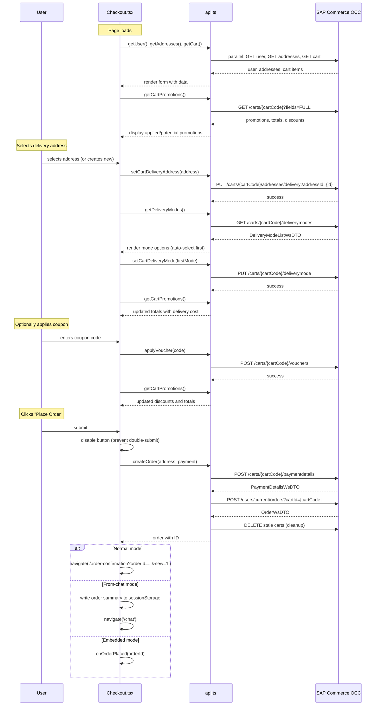
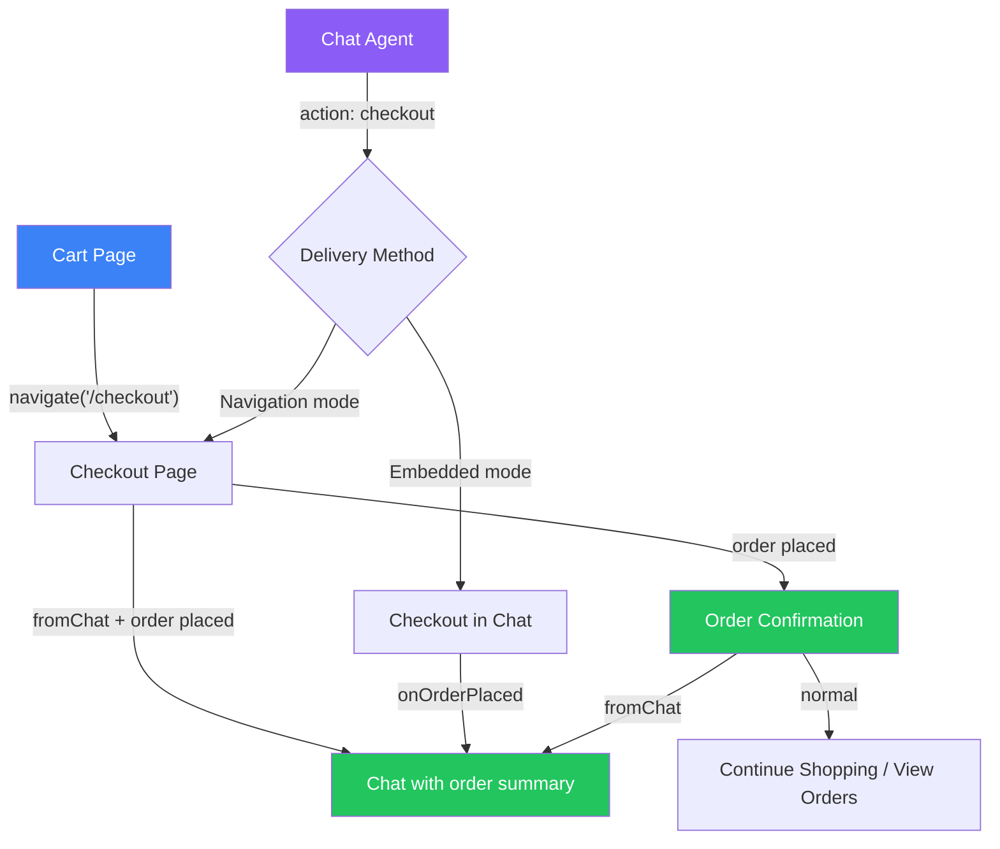
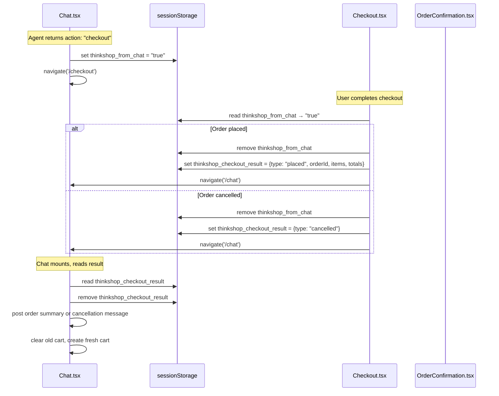
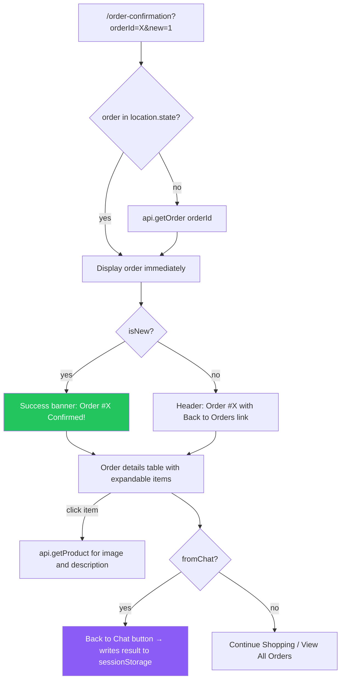

# Checkout Flow — Diagrams

## Checkout Page Sequence

The checkout page loads data in parallel, then reacts to user selections. Address selection triggers delivery mode fetching. Order placement sets payment and places the order in sequence.

## Checkout Entry Points

The checkout can be reached three ways, each with a different return path after order placement.

## Session Storage Communication

When checkout is triggered from the chat via navigation (not embedded), sessionStorage bridges the two pages.

## Order Confirmation Page

The confirmation page serves both new orders and order history lookups, with expandable product details.

