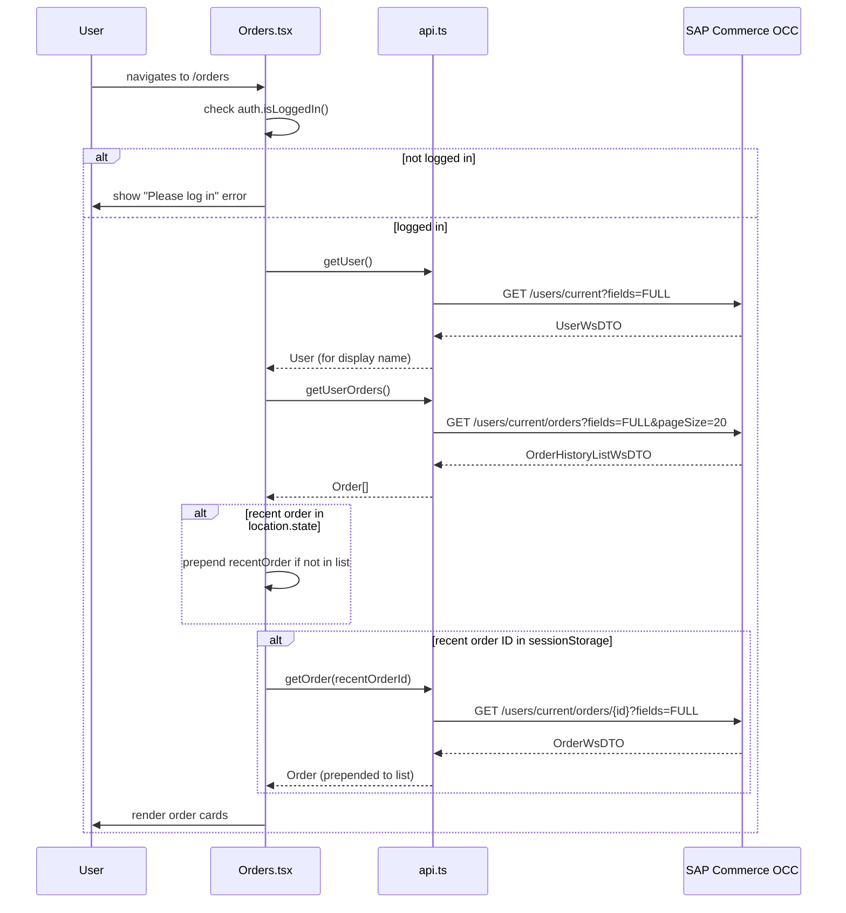
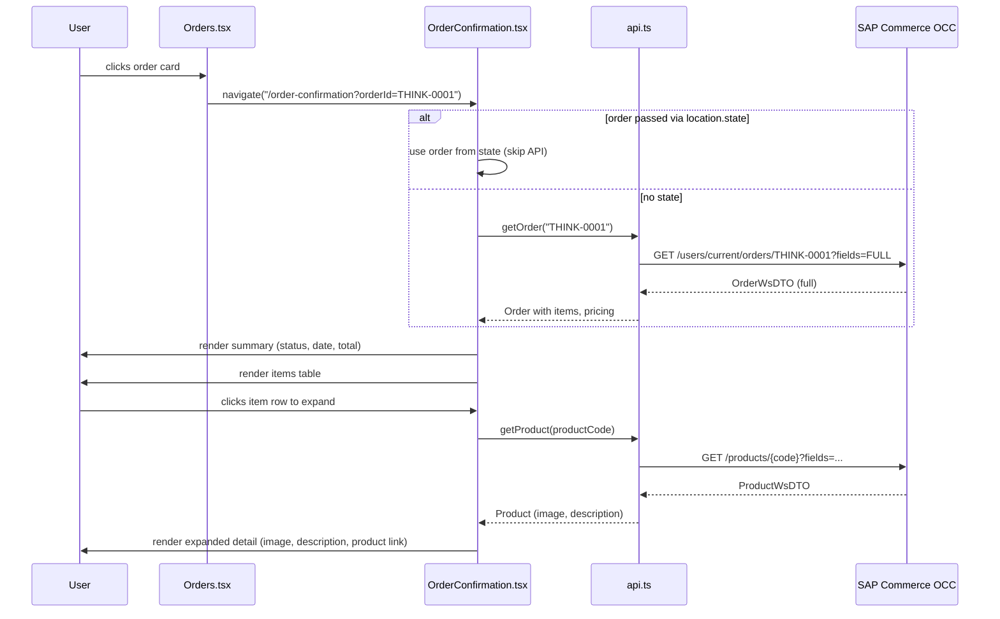
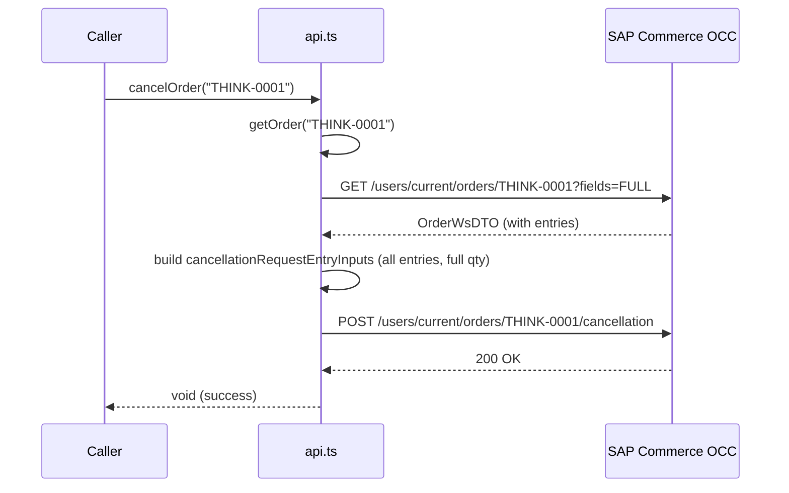
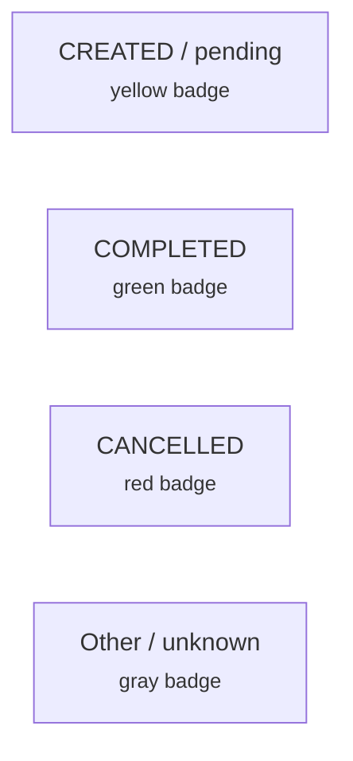
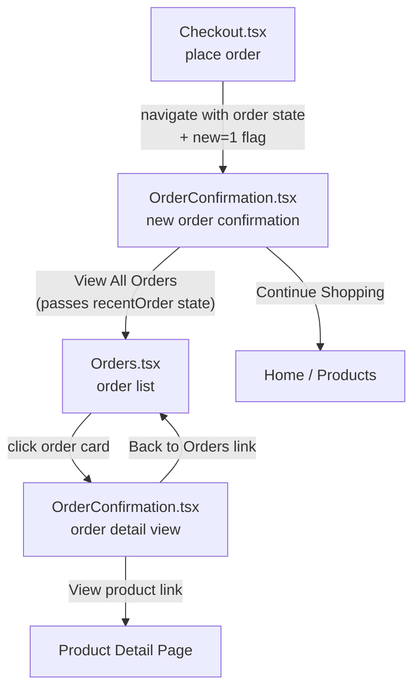

# Order History — Diagrams

## Order List Flow

The user navigates to `/orders`. The page checks authentication, fetches the order list, merges any recently placed order, and renders clickable cards.

## Order Detail Expansion

Clicking an order card navigates to the OrderConfirmation page, which shows the full detail view. Each line item row can be expanded to show product image and description.

## Cancel Order Flow

The cancel method is available in the API layer. It fetches the full order to build entry-level cancellation inputs, then submits the cancellation request.

## Order Status Colors

Status badges are color-coded on both the list cards and the detail view.

## Page Navigation

How users move between order-related pages.

