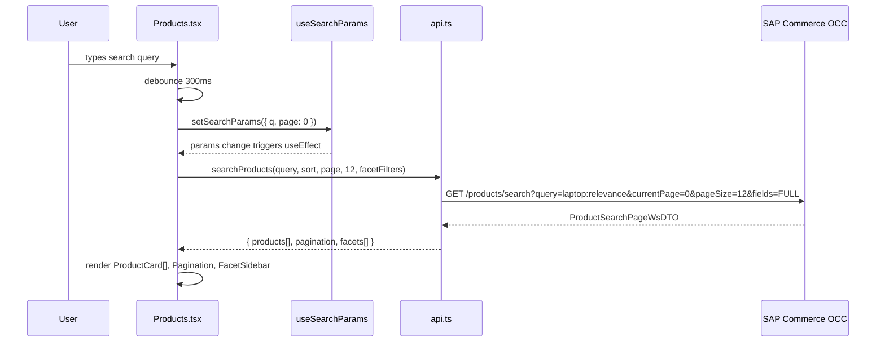
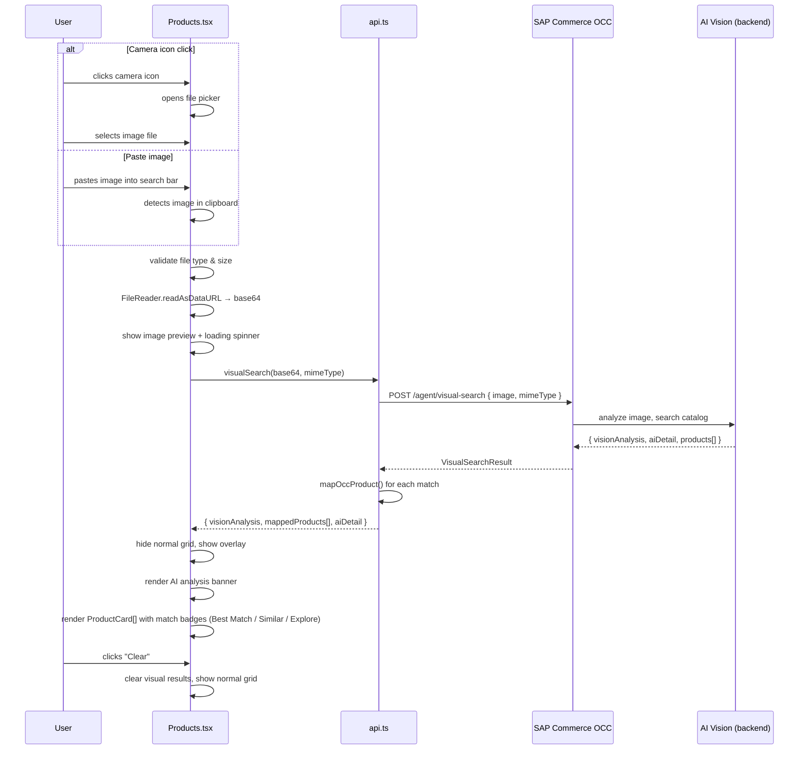
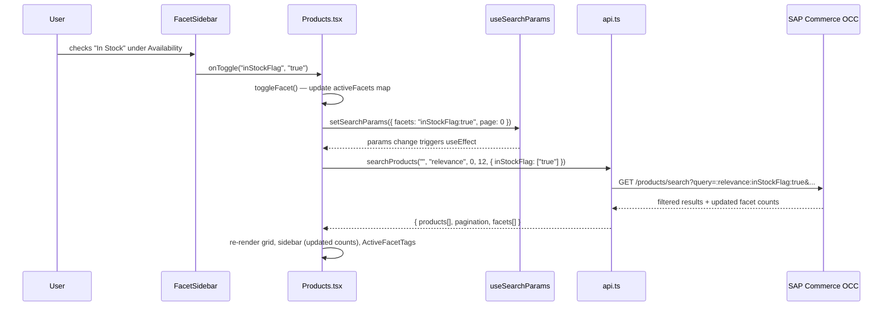
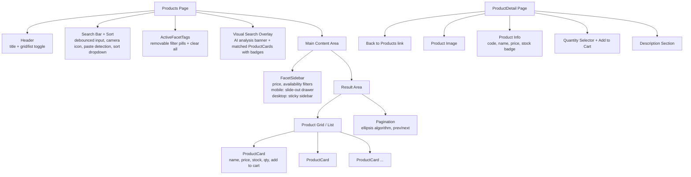

# Product Browse — Diagrams

## Search and Display Flow

When the user searches or changes filters, the Products page reads state from URL params, calls the OCC API, and renders the results. Search input is debounced so the API call fires only after 300ms of inactivity.

## Visual Search Flow

When the user uploads an image (camera icon) or pastes one into the search bar, the image is base64-encoded and sent to the backend AI vision endpoint. Results overlay the normal product grid with match-type badges and confidence scores.

## Facet Interaction Flow

When the user toggles a facet checkbox, the URL is updated with serialized facet state, which triggers a new search with the facet values appended to the OCC query string.

## Component Layout

