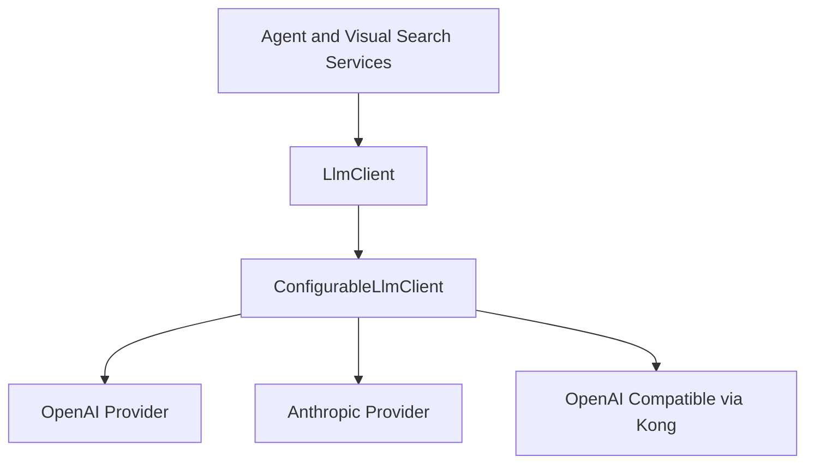

# Multi-provider LLM client plan

## Current state

- [`OpenAiClient`](sap-mcp-server-l/core-customize/hybris/bin/custom/coremcp/src/com/coremcp/services/OpenAiClient.java) is the single abstraction for chat completions.
- [`DefaultOpenAiClient`](sap-mcp-server-l/core-customize/hybris/bin/custom/coremcp/src/com/coremcp/services/impl/DefaultOpenAiClient.java) is hard-coded to the OpenAI chat completions endpoint and OpenAI bearer auth.
- [`DefaultAgentService`](sap-mcp-server-l/core-customize/hybris/bin/custom/coremcp/src/com/coremcp/services/impl/DefaultAgentService.java) and [`DefaultVisualSearchService`](sap-mcp-server-l/core-customize/hybris/bin/custom/coremcp/src/com/coremcp/services/impl/DefaultVisualSearchService.java) depend on the current client bean alias [`openAiClient`](sap-mcp-server-l/core-customize/hybris/bin/custom/coremcp/resources/coremcp-spring.xml).
- There is no existing provider routing, no Kong-specific configuration, and no Anthropic-specific request mapping.

## Recommended design

### 1. Rename the abstraction without changing call sites first

Introduce a provider-neutral interface such as [`LlmClient`](sap-mcp-server-l/core-customize/hybris/bin/custom/coremcp/src/com/coremcp/services/LlmClient.java) with the same two methods currently exposed by [`OpenAiClient`](sap-mcp-server-l/core-customize/hybris/bin/custom/coremcp/src/com/coremcp/services/OpenAiClient.java).

For migration safety:
- Keep [`OpenAiClient`](sap-mcp-server-l/core-customize/hybris/bin/custom/coremcp/src/com/coremcp/services/OpenAiClient.java) temporarily as either:
  - an interface extending [`LlmClient`](sap-mcp-server-l/core-customize/hybris/bin/custom/coremcp/src/com/coremcp/services/LlmClient.java), or
  - replace usages directly in dependent services in one pass.
- Preserve the Spring alias [`openAiClient`](sap-mcp-server-l/core-customize/hybris/bin/custom/coremcp/resources/coremcp-spring.xml) during transition so existing bean wiring does not break.

### 2. Split provider selection from HTTP execution

Replace the current single implementation with three layers:

Suggested classes:
- [`LlmClient`](sap-mcp-server-l/core-customize/hybris/bin/custom/coremcp/src/com/coremcp/services/LlmClient.java)
- [`DefaultLlmClient`](sap-mcp-server-l/core-customize/hybris/bin/custom/coremcp/src/com/coremcp/services/impl/DefaultLlmClient.java) as the routing facade
- [`LlmProvider`](sap-mcp-server-l/core-customize/hybris/bin/custom/coremcp/src/com/coremcp/services/LlmProvider.java) strategy interface
- [`OpenAiLlmProvider`](sap-mcp-server-l/core-customize/hybris/bin/custom/coremcp/src/com/coremcp/services/impl/OpenAiLlmProvider.java)
- [`AnthropicLlmProvider`](sap-mcp-server-l/core-customize/hybris/bin/custom/coremcp/src/com/coremcp/services/impl/AnthropicLlmProvider.java)
- [`OpenAiCompatibleLlmProvider`](sap-mcp-server-l/core-customize/hybris/bin/custom/coremcp/src/com/coremcp/services/impl/OpenAiCompatibleLlmProvider.java) for Kong-backed endpoints that accept OpenAI-style payloads

Why this split works:
- OpenAI and Kong-openai-compatible traffic can share nearly identical request and response handling.
- Anthropic requires different request headers and a different response schema, so it should be isolated behind its own mapper.
- Future providers can be added without changing agent orchestration logic in [`DefaultAgentService`](sap-mcp-server-l/core-customize/hybris/bin/custom/coremcp/src/com/coremcp/services/impl/DefaultAgentService.java).

### 3. Standardize an internal response contract

Both [`DefaultAgentService`](sap-mcp-server-l/core-customize/hybris/bin/custom/coremcp/src/com/coremcp/services/impl/DefaultAgentService.java) and likely [`DefaultVisualSearchService`](sap-mcp-server-l/core-customize/hybris/bin/custom/coremcp/src/com/coremcp/services/impl/DefaultVisualSearchService.java) currently expect an OpenAI-shaped response with fields like `choices`, `message`, `content`, and `tool_calls`.

The least risky approach is:
- keep [`LlmClient.chatCompletion()`](sap-mcp-server-l/core-customize/hybris/bin/custom/coremcp/src/com/coremcp/services/LlmClient.java:1) returning the same normalized map shape already consumed by the application
- have each provider translate its native API response into that normalized OpenAI-like structure

That avoids a larger refactor in the agent loop.

### 4. Add config-driven provider routing

Add a top-level selector:
- `coremcp.llm.provider=openai|anthropic|kong-openai`

Suggested config groups:

#### Common
- `coremcp.llm.provider`
- `coremcp.llm.timeout.seconds`

#### OpenAI direct
- `coremcp.openai.apikey`
- `coremcp.openai.model`
- `coremcp.openai.intent.model`
- optional `coremcp.openai.baseurl`

#### Anthropic direct
- `coremcp.anthropic.apikey`
- `coremcp.anthropic.model`
- `coremcp.anthropic.intent.model`
- optional `coremcp.anthropic.baseurl`
- optional `coremcp.anthropic.version`

#### Kong openai-compatible route
- `coremcp.kong.apikey`
- `coremcp.kong.baseurl`
- `coremcp.kong.chat.completions.path`
- `coremcp.kong.model`
- `coremcp.kong.intent.model`

Environment variable fallback should mirror the config naming strategy where practical:
- `OPENAI_API_KEY`
- `ANTHROPIC_API_KEY`
- `KONG_LLM_API_KEY`
- optionally `COREMCP_LLM_PROVIDER`

### 5. Treat Kong as transport plus auth, not as a model provider

Because you want both direct Anthropic and Kong-routed access selectable by config, Kong should be modeled as a gateway target, not as the semantic provider identity.

Practical implication:
- if Kong exposes an OpenAI-compatible endpoint, use [`OpenAiCompatibleLlmProvider`](sap-mcp-server-l/core-customize/hybris/bin/custom/coremcp/src/com/coremcp/services/impl/OpenAiCompatibleLlmProvider.java)
- if Kong later fronts Anthropic-native endpoints, add a separate provider or mode such as `kong-anthropic`
- do not bake Roo-specific assumptions into the generic provider contract; only configure headers, base URL, and key resolution

### 6. Minimize service-layer churn

Implementation should only require small changes in:
- [`DefaultAgentService`](sap-mcp-server-l/core-customize/hybris/bin/custom/coremcp/src/com/coremcp/services/impl/DefaultAgentService.java) to stop reading provider-specific property names for intent model
- [`DefaultVisualSearchService`](sap-mcp-server-l/core-customize/hybris/bin/custom/coremcp/src/com/coremcp/services/impl/DefaultVisualSearchService.java) if it assumes OpenAI-specific model defaults
- [`coremcp-spring.xml`](sap-mcp-server-l/core-customize/hybris/bin/custom/coremcp/resources/coremcp-spring.xml) to wire the new routing client and provider beans

Recommended rule:
- move provider-specific model resolution into [`DefaultLlmClient`](sap-mcp-server-l/core-customize/hybris/bin/custom/coremcp/src/com/coremcp/services/impl/DefaultLlmClient.java)
- dependent services should ask for chat completions and optionally pass `modelOverride`, but should not know whether the backing provider is OpenAI, Anthropic, or Kong

## Execution plan

- [ ] Add a provider-neutral client interface and migration-safe alias from [`OpenAiClient`](sap-mcp-server-l/core-customize/hybris/bin/custom/coremcp/src/com/coremcp/services/OpenAiClient.java)
- [ ] Implement provider strategy classes for direct OpenAI, direct Anthropic, and Kong OpenAI-compatible routing
- [ ] Introduce normalized request-building and response-normalization helpers so all providers return the same internal shape
- [ ] Add config resolution for provider selection, model defaults, base URLs, API keys, and environment fallbacks
- [ ] Update [`coremcp-spring.xml`](sap-mcp-server-l/core-customize/hybris/bin/custom/coremcp/resources/coremcp-spring.xml) to wire a routing client while preserving existing bean aliases used by services
- [ ] Refactor [`DefaultAgentService`](sap-mcp-server-l/core-customize/hybris/bin/custom/coremcp/src/com/coremcp/services/impl/DefaultAgentService.java) and [`DefaultVisualSearchService`](sap-mcp-server-l/core-customize/hybris/bin/custom/coremcp/src/com/coremcp/services/impl/DefaultVisualSearchService.java) to stop depending on OpenAI-only config names where not needed
- [ ] Add or update tests for provider selection, config fallback behavior, and Anthropic response normalization
- [ ] Document new properties in a config or docs file under [`docs/`](sap-mcp-server-l/docs/README.md)

## Recommendation summary

Use a routing [`LlmClient`](sap-mcp-server-l/core-customize/hybris/bin/custom/coremcp/src/com/coremcp/services/LlmClient.java) that selects one of three providers at runtime:
- direct OpenAI
- direct Anthropic
- Kong OpenAI-compatible endpoint

Keep the app-facing response format OpenAI-like to avoid destabilizing the existing tool loop in [`DefaultAgentService`](sap-mcp-server-l/core-customize/hybris/bin/custom/coremcp/src/com/coremcp/services/impl/DefaultAgentService.java). Put all provider differences behind strategy classes and config resolution.
