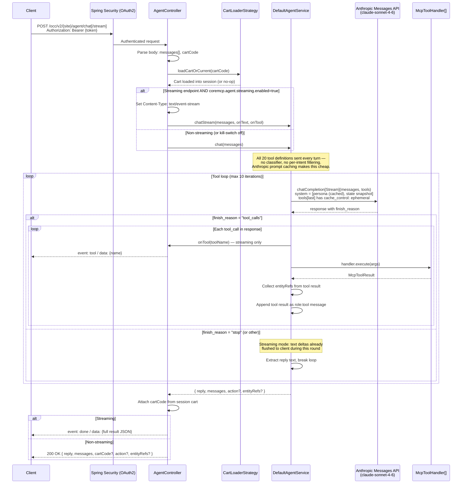
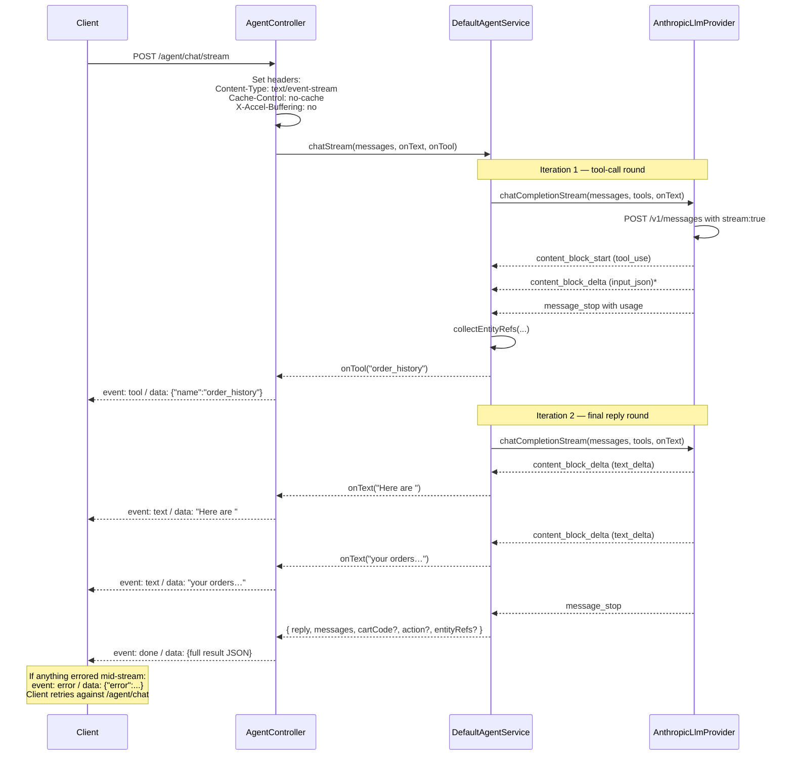
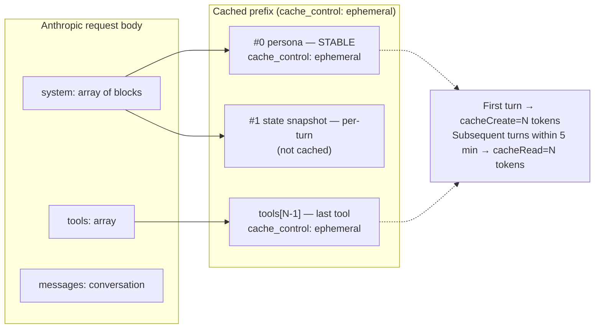
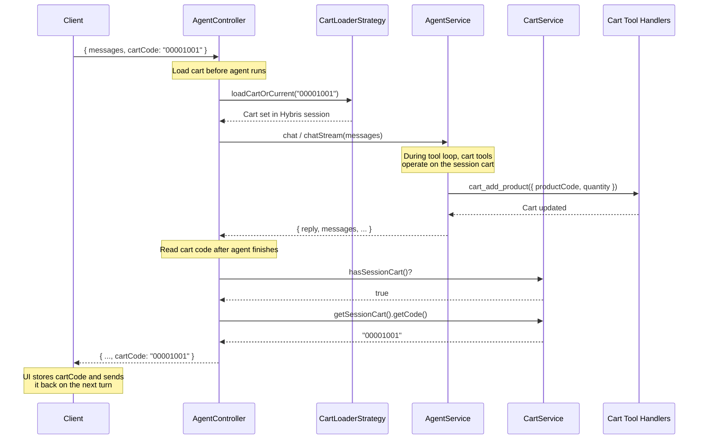

# Agent Chat — Diagrams

## Full Request Flow

End-to-end trace from the client sending a chat message to receiving the agent's response. Two endpoints are exposed: a JSON one (`/agent/chat`) and a Server-Sent Events one (`/agent/chat/stream`). The client tries streaming first and transparently falls back to JSON when the gateway strips SSE or `coremcp.agent.streaming.enabled=false`.



## Tool Execution Loop

Detail of `DefaultAgentService.runChat()`. Same body services both `chat()` (no-op text consumer → behaves like the old non-streaming path) and `chatStream()` (consumers wired to the SSE writer).

```mermaid
flowchart TD
    Start([runChat called]) --> BuildState[Build state snapshot<br/>customer + cart + applied vouchers]
    BuildState --> Prepend[Prepend persona + state<br/>as two system messages]
    Prepend --> Call[Call llmClient.chatCompletion or<br/>chatCompletionStream<br/>with messages + ALL tools]

    Call --> Stream{Streaming?}
    Stream -->|Yes| Emit[Emit text deltas to onText<br/>as SSE 'text' events]
    Stream -->|No| Buffer[Provider buffers full response]
    Emit --> Check
    Buffer --> Check

    Check{finish_reason =<br/>"tool_calls"?}

    Check -->|No| Extract[Extract reply from<br/>assistant message content]
    Extract --> Build[Build result:<br/>reply, messages, cartCode,<br/>action?, entityRefs?]
    Build --> Return([Return result Map])

    Check -->|Yes| Iterate{iteration < 10?}
    Iterate -->|No| Fallback([Return apology message<br/>+ entityRefs collected so far])

    Iterate -->|Yes| Dedupe{Already-seen<br/>tool+args?}
    Dedupe -->|Yes| Skip[Use placeholder: 'reuse previous result']
    Dedupe -->|No| ToolEvent[onTool toolName<br/>SSE 'tool' event]
    ToolEvent --> Lookup[Look up handler by name]
    Lookup --> Execute[handler.execute args]
    Execute --> CollectRefs[Collect entityRefs<br/>product/order/orderHistory codes]
    CollectRefs --> Append[Append role:tool message<br/>with result content]
    Skip --> Append
    Append --> Call
```

## SSE Event Stream

Wire format produced by `/agent/chat/stream`. The provider's auto-fallback to non-streaming and the controller's kill-switch both produce a plain `application/json` body instead — the client detects this via `Content-Type` and parses it directly.



## Anthropic Prompt Caching

The persona prompt and tool definitions are stable across turns; the per-turn state snapshot is not. Two `cache_control: ephemeral` breakpoints — one on the persona system block, one on the last tool — let Anthropic cache the stable prefix for ~5 minutes between turns.



## Cart Sync Flow

Unchanged. The controller manages cart state around the agent call so tool handlers that modify the cart operate on the correct cart.


