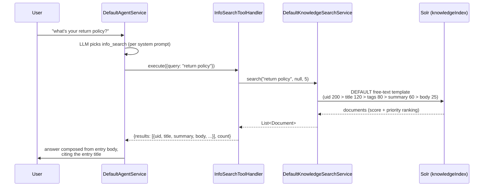
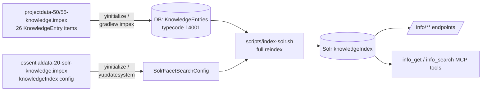

# Knowledge Base — Diagrams

## Read path — agent question to governed answer

A chat turn like "what's your return policy?" never touches the database on the
read path: the agent calls `info_search`, the service queries Solr, and the
answer is composed from indexed content.

The public REST path is the same minus the agent:
`GET /info/search` → `KnowledgeController` → `KnowledgeSearchService` → Solr.
On any Solr failure the service returns empty results (warning logged) — the
endpoint answers `{results: [], count: 0}` and the agent falls back to a
generic answer rather than failing the turn.

## Content path — ImpEx to searchable

Content is invisible to search until the reindex runs — `index-solr.sh` is part
of the documented setup flow and required after any knowledge ImpEx change.
