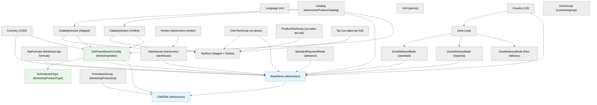

# Store Infrastructure — Diagrams

## Dependency Graph

Shows what depends on what. Items at the top must exist before items below them can be created. This drives the import ordering within the ImpEx files.

## Load Order

Two essentialdata files load in alphabetical order. Within each file, ImpEx blocks execute top-to-bottom, following the dependency graph above.

```mermaid
%%{ init: { 'theme': 'neutral' } }%%
graph LR
    subgraph "essentialdata-00-infrastructure.impex"
        A1["OAuth Clients"] --> A2["Language, Currency, Country, Unit"]
        A2 --> A3["Catalog + Versions"]
        A3 --> A4["Vendor + Warehouse"]
        A4 --> A5["Tax Groups + TaxRows"]
        A5 --> A6["Zone + Delivery Modes"]
        A6 --> A7["Payment Mode"]
        A7 --> A8["BaseStore + CMSSite"]
        A8 --> A9["CustomerGroup"]
    end

    subgraph "essentialdata-10-solr.impex"
        B1["SolrFacetSearchConfig"] --> B2["SolrIndexedType"]
        B2 --> B3["Value Ranges"]
        B3 --> B4["Indexed Properties"]
        B4 --> B5["Sorts"]
        B5 --> B6["Search Query Template"]
        B6 --> B7["Indexer Queries + Cron Jobs"]
        B7 --> B8["Wire to BaseStore + CMSSite"]
    end

    A9 --> B1

    style A8 fill:#e1f5fe
    style B8 fill:#e8f5e9
```

