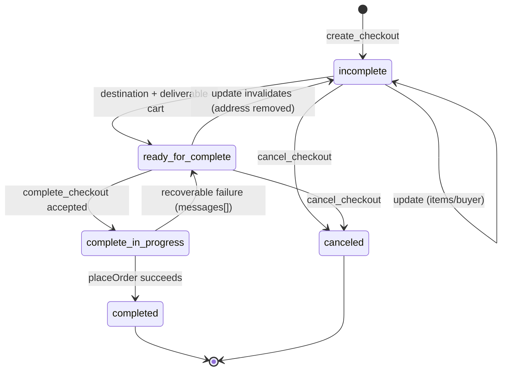

# UCP checkout — diagram

The status lifecycle (derived from cart state on every operation, design S5):



`complete_checkout` internals — mock payment + idempotency (design S3):

```mermaid
sequenceDiagram
    participant U as UCP client
    participant S as UcpCheckoutService
    participant E as UcpCheckoutSessionEntry
    participant F as CheckoutFacade
    U->>S: complete_checkout (id, instruments[{handler_id, credential}], idempotency-key)
    S->>E: resolve id; read stored key + response
    alt duplicate idempotency-key
        E-->>S: stored completion response
        S-->>U: replay verbatim (no facade calls, no second placeOrder)
    else handler_id != thinkshop_mock_card
        S-->>U: ucp.status=error, unrecoverable message naming the declared handler
    else first call, known handler
        S->>E: beginCompletion (status complete_in_progress, key stored)
        S->>F: loadCart(cartCode)
        S->>F: createPaymentSubscription (mock Visa 4111…, credential never read)
        S->>F: authorizePayment("123") — boolean ignored (mock path)
        S->>F: placeOrder() — consumes the session cart
        F-->>S: OrderData
        S->>E: recordCompletion (ONE save: completed + response JSON + order code)
        S-->>U: checkout {status=completed, order.id, totals}
    end
```
