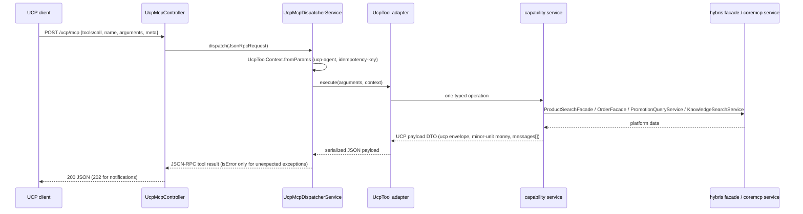
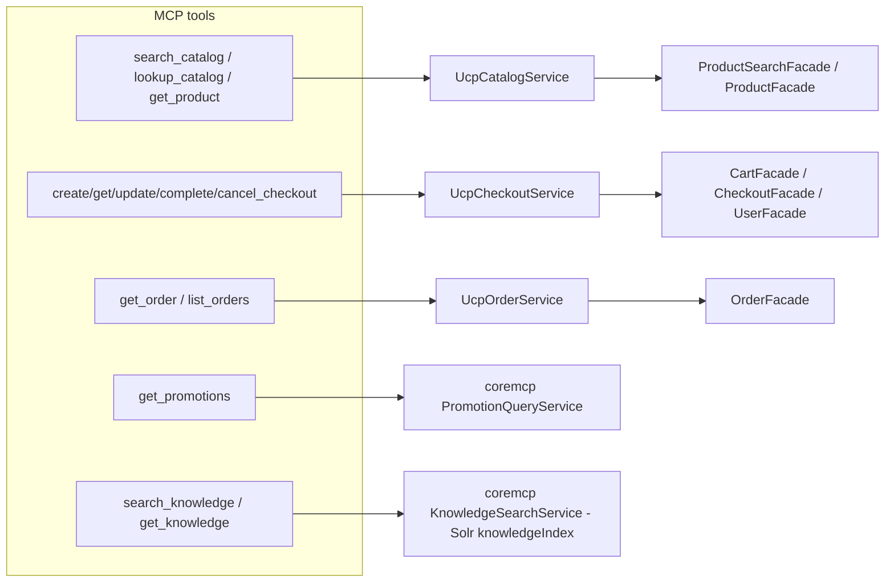

# UCP MCP binding — diagram

One `tools/call` through the stateless binding (read path — catalog, orders,
custom capabilities; the checkout flow's stateful bracket is in the
ucp-checkout diagram):

Tool → backing service map (13 tools after Phase 6):

