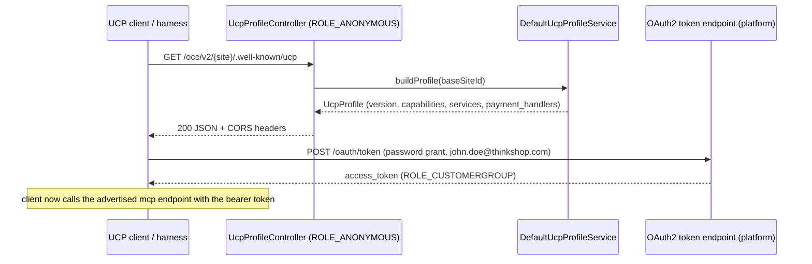
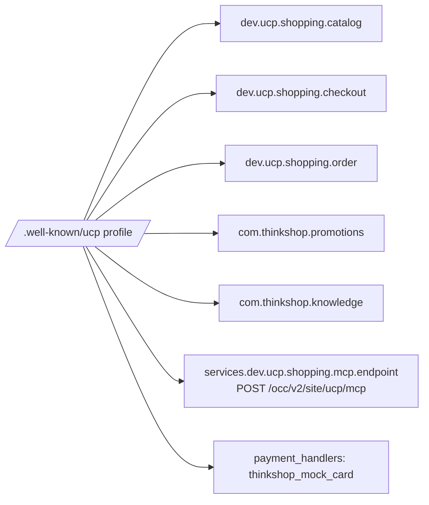

# UCP profile — diagram

Discovery and auth bootstrap (design S1). The profile is the only anonymous
endpoint; every capability operation needs the password-grant bearer token
(design R8 — a documented local-testing concession).

Advertised capability set after Phase 6 (all versioned with the pinned
`2026-04-08` string):

