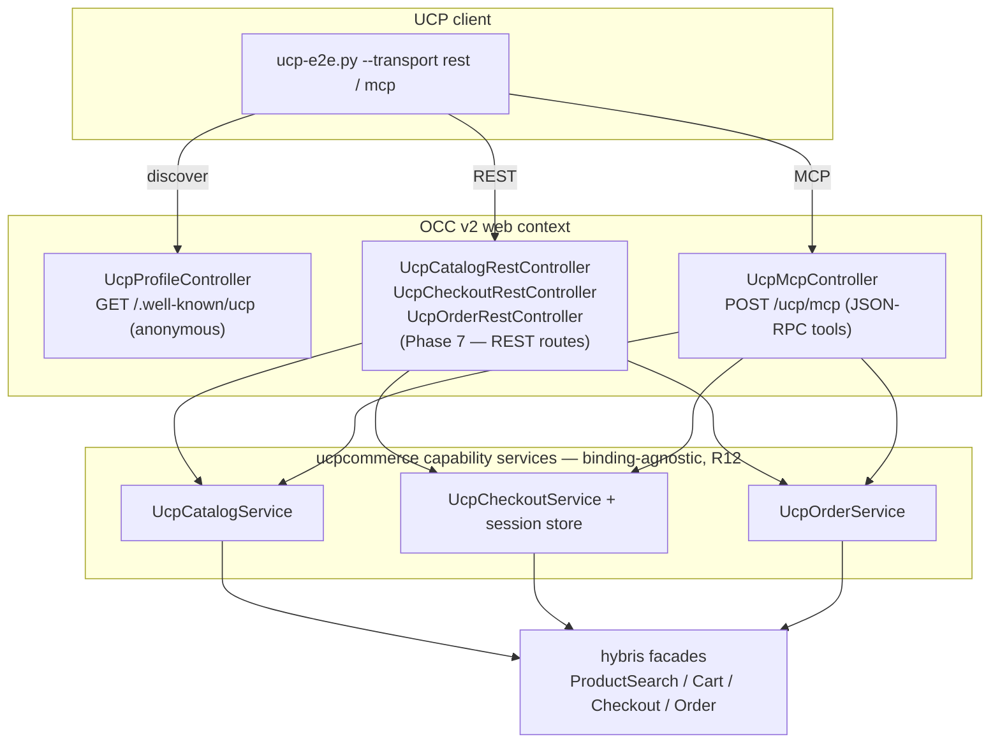
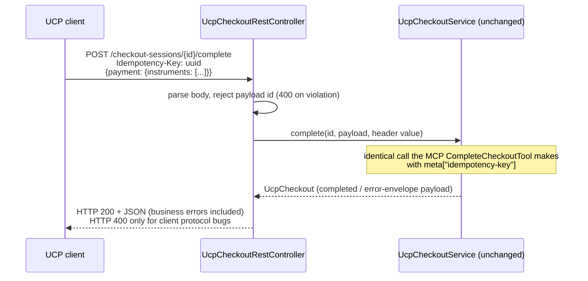

# UCP REST binding — diagram

Both transports are thin adapters over the same capability services — the
REST binding adds the left-hand path without touching anything below the
controller layer:

Request/response mapping on the checkout complete route (the one operation
with a header mapping):

