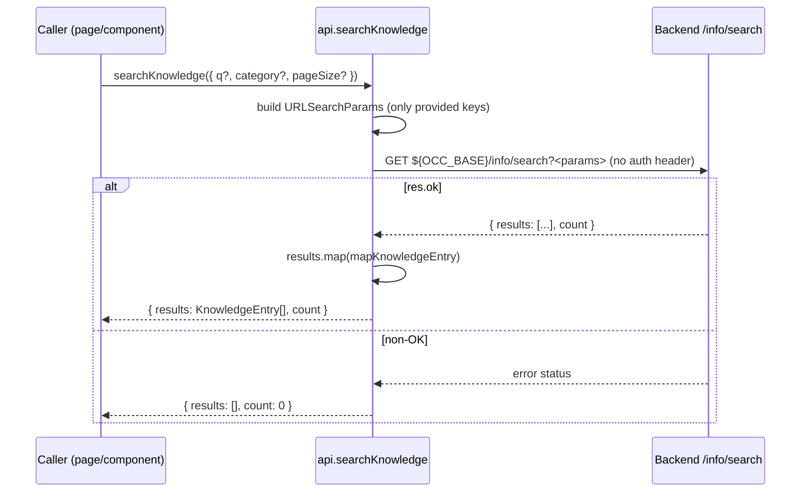
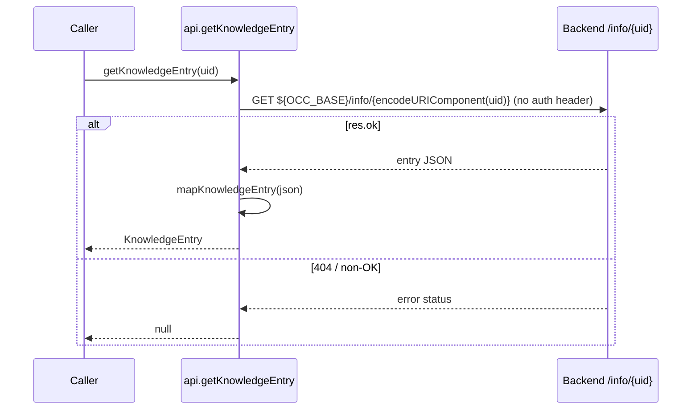

# Knowledge Base — Diagrams

## Search flow (`api.searchKnowledge`)

A caller (e.g. the future Help center) asks for KB entries; the api layer fetches the
public endpoint, maps each entry, and degrades to an empty result on any non-OK response.

## Get-by-uid flow (`api.getKnowledgeEntry`)

The non-OK branches are deliberate: KB is non-critical chrome, so a backend error renders
as "no content" rather than a thrown exception that would break the host page.
