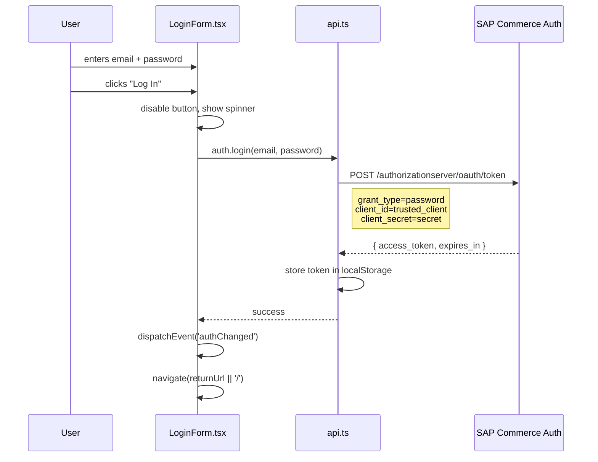
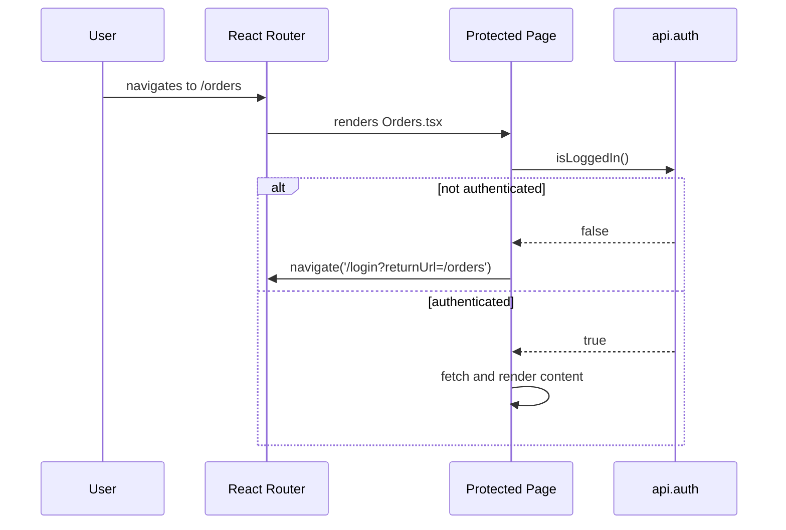
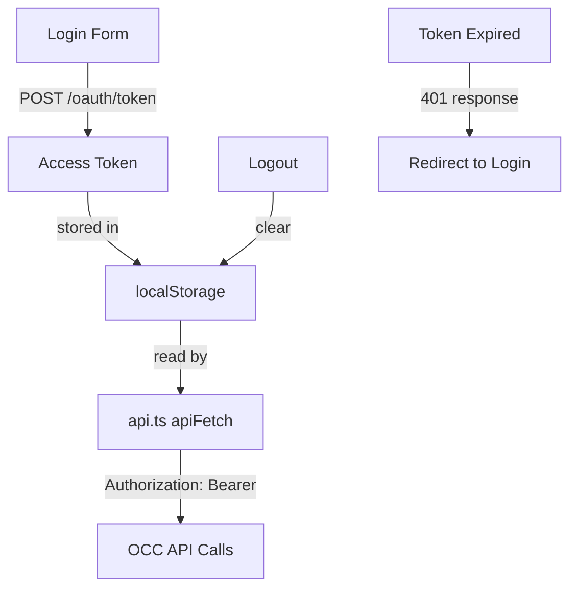

# Authentication — Diagrams

## Login Flow

```mermaid
sequenceDiagram
    participant User
    participant Login as LoginForm.tsx
    participant API as api.ts
    participant SAP as SAP Commerce Auth

    User->>Login: enters email + password
    User->>Login: clicks "Log In"
    Login->>Login: disable button, show spinner
    Login->>API: auth.login(email, password)
    API->>SAP: POST /authorizationserver/oauth/token
    Note right of API: grant_type=password<br/>client_id=trusted_client<br/>client_secret=secret
    SAP-->>API: { access_token, expires_in }
    API->>API: store token in localStorage
    API-->>Login: success
    Login->>Login: dispatchEvent('authChanged')
    Login->>Login: navigate(returnUrl || '/')
```

## Protected Route Pattern

```mermaid
sequenceDiagram
    participant User
    participant Router as React Router
    participant Page as Protected Page
    participant Auth as api.auth

    User->>Router: navigates to /orders
    Router->>Page: renders Orders.tsx
    Page->>Auth: isLoggedIn()
    alt not authenticated
        Auth-->>Page: false
        Page->>Router: navigate('/login?returnUrl=/orders')
    else authenticated
        Auth-->>Page: true
        Page->>Page: fetch and render content
    end
```

## Token Lifecycle

```mermaid
graph TD
    Login[Login Form] -->|POST /oauth/token| Token[Access Token]
    Token -->|stored in| LS[localStorage]
    LS -->|read by| API[api.ts apiFetch]
    API -->|Authorization: Bearer| OCC[OCC API Calls]
    Logout[Logout] -->|clear| LS
    Expired[Token Expired] -->|401 response| Redirect[Redirect to Login]
```
