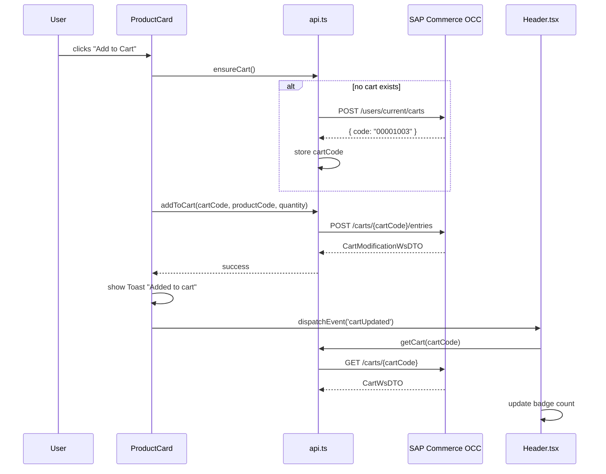

# Cart Management — Diagrams

## Add to Cart Flow

When the user adds a product, the UI ensures a cart exists, adds the entry, and updates the cart badge.



## Cart Drawer Interaction

```mermaid
graph TD
    Header[Header - Cart Icon + Badge]
    Header -->|click| Modal[CartModal Drawer]
    Modal --> Items[Cart Entry List]
    Items --> Qty[Quantity +/- Controls]
    Items --> Remove[Remove Button]
    Qty -->|PATCH| OCC[OCC API]
    Remove -->|DELETE| OCC
    OCC --> Event[dispatchEvent cartUpdated]
    Event --> Header
    Modal --> Checkout[Proceed to Checkout]
    Checkout -->|navigate| CheckoutPage[/checkout]
```
