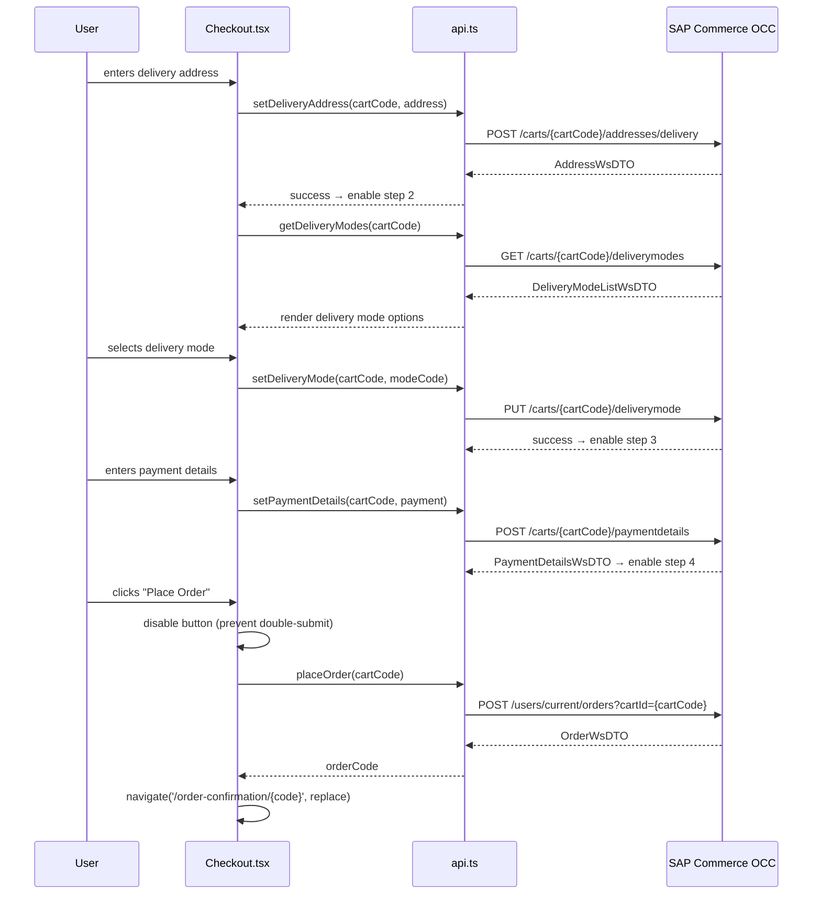

# Checkout Flow — Diagrams

## Multi-Step Checkout Sequence

The checkout requires steps in order. Each step calls an OCC endpoint before the next step becomes available.

```mermaid
sequenceDiagram
    participant User
    participant Checkout as Checkout.tsx
    participant API as api.ts
    participant OCC as SAP Commerce OCC

    User->>Checkout: enters delivery address
    Checkout->>API: setDeliveryAddress(cartCode, address)
    API->>OCC: POST /carts/{cartCode}/addresses/delivery
    OCC-->>API: AddressWsDTO
    API-->>Checkout: success → enable step 2

    Checkout->>API: getDeliveryModes(cartCode)
    API->>OCC: GET /carts/{cartCode}/deliverymodes
    OCC-->>API: DeliveryModeListWsDTO
    API-->>Checkout: render delivery mode options

    User->>Checkout: selects delivery mode
    Checkout->>API: setDeliveryMode(cartCode, modeCode)
    API->>OCC: PUT /carts/{cartCode}/deliverymode
    OCC-->>API: success → enable step 3

    User->>Checkout: enters payment details
    Checkout->>API: setPaymentDetails(cartCode, payment)
    API->>OCC: POST /carts/{cartCode}/paymentdetails
    OCC-->>API: PaymentDetailsWsDTO → enable step 4

    User->>Checkout: clicks "Place Order"
    Checkout->>Checkout: disable button (prevent double-submit)
    Checkout->>API: placeOrder(cartCode)
    API->>OCC: POST /users/current/orders?cartId={cartCode}
    OCC-->>API: OrderWsDTO
    API-->>Checkout: orderCode
    Checkout->>Checkout: navigate('/order-confirmation/{code}', replace)
```

## Step Progression

```mermaid
graph LR
    A[1. Delivery Address] -->|address set| B[2. Shipping Method]
    B -->|mode selected| C[3. Payment Details]
    C -->|payment set| D[4. Review & Place Order]
    D -->|order placed| E[Order Confirmation]

    style A fill:#3b82f6,color:#fff
    style E fill:#22c55e,color:#fff
```
