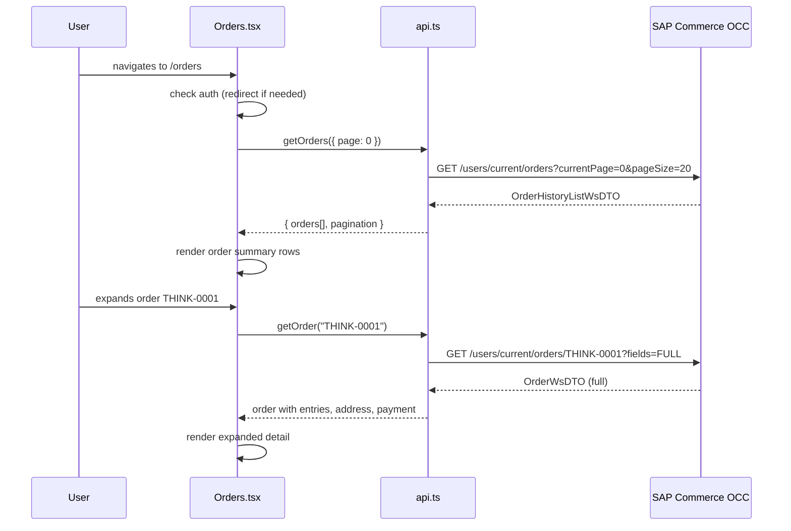
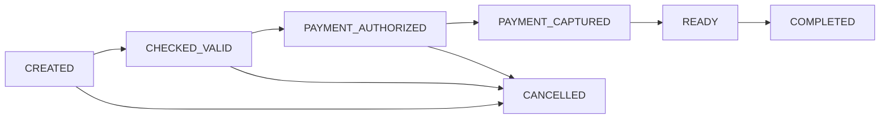

# Order History — Diagrams

## Order List and Detail Flow

```mermaid
sequenceDiagram
    participant User
    participant Orders as Orders.tsx
    participant API as api.ts
    participant OCC as SAP Commerce OCC

    User->>Orders: navigates to /orders
    Orders->>Orders: check auth (redirect if needed)
    Orders->>API: getOrders({ page: 0 })
    API->>OCC: GET /users/current/orders?currentPage=0&pageSize=20
    OCC-->>API: OrderHistoryListWsDTO
    API-->>Orders: { orders[], pagination }
    Orders->>Orders: render order summary rows

    User->>Orders: expands order THINK-0001
    Orders->>API: getOrder("THINK-0001")
    API->>OCC: GET /users/current/orders/THINK-0001?fields=FULL
    OCC-->>API: OrderWsDTO (full)
    API-->>Orders: order with entries, address, payment
    Orders->>Orders: render expanded detail
```

## Order Status Flow

```mermaid
graph LR
    CREATED --> CHECKED_VALID
    CHECKED_VALID --> PAYMENT_AUTHORIZED
    PAYMENT_AUTHORIZED --> PAYMENT_CAPTURED
    PAYMENT_CAPTURED --> READY
    READY --> COMPLETED

    CREATED --> CANCELLED
    CHECKED_VALID --> CANCELLED
    PAYMENT_AUTHORIZED --> CANCELLED
```
