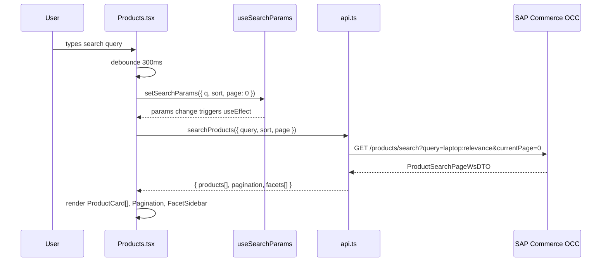
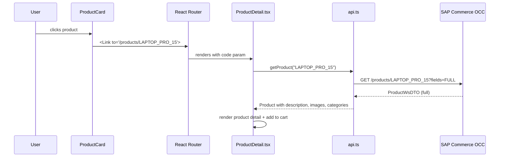
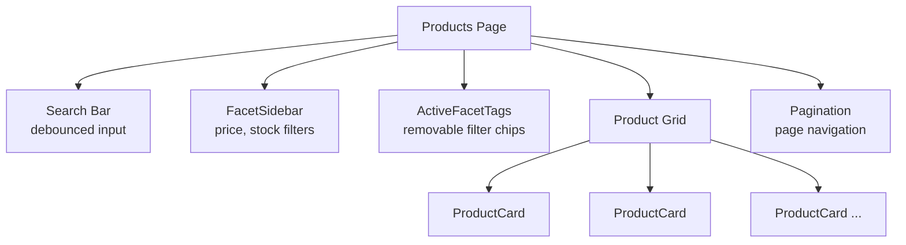

# Product Browse — Diagrams

## Search and Display Flow

When the user searches or changes filters, the Products page reads state from URL params, calls the OCC API, and renders the results.

## Product Detail Flow

When the user clicks a product card, React Router navigates to the detail page which fetches full product data.

## Component Layout

